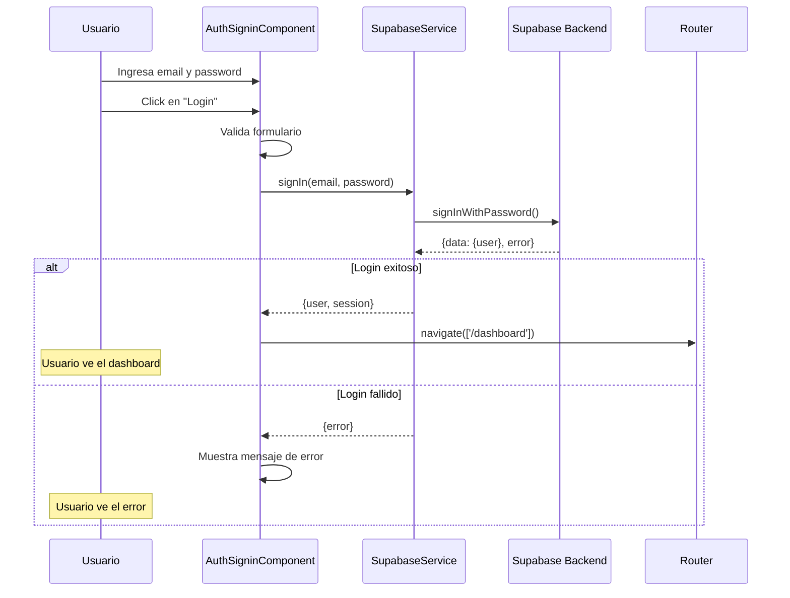
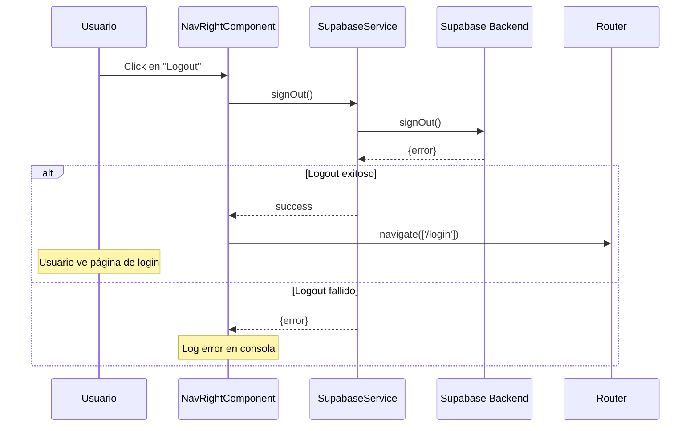

# 🔐 Sistema de Autenticación

Esta guía explica el funcionamiento del sistema de autenticación implementado con Supabase en el proyecto IGAS.

## Tabla de Contenidos

- [Arquitectura General](#arquitectura-general)
- [Seguridad](#seguridad)
- [Componentes Principales](#componentes-principales)
- [Flujo de Autenticación](#flujo-de-autenticación)
- [Guards de Rutas](#guards-de-rutas)
- [Uso del Sistema](#uso-del-sistema)
- [Ejemplos de Código](#ejemplos-de-código)
- [Troubleshooting](#troubleshooting)

## Arquitectura General

El sistema de autenticación está construido sobre **Supabase** y utiliza el patrón de servicios de Angular junto con guards funcionales para proteger las rutas.

```
┌─────────────────────────────────────────────────────────────┐
│                    Usuario Final                             │
└────────────────────┬────────────────────────────────────────┘
                     │
                     ▼
┌─────────────────────────────────────────────────────────────┐
│           Componentes de Autenticación                       │
│  ┌──────────────────┐        ┌──────────────────┐          │
│  │ AuthSignin       │        │ NavRight         │          │
│  │ Component        │        │ Component        │          │
│  └────────┬─────────┘        └────────┬─────────┘          │
└───────────┼──────────────────────────┼─────────────────────┘
            │                          │
            ▼                          ▼
┌─────────────────────────────────────────────────────────────┐
│                  SupabaseService                             │
│  • signIn()                                                  │
│  • signOut()                                                 │
│  • signUp()                                                  │
│  • currentUser$ (Observable)                                 │
└────────────────────┬────────────────────────────────────────┘
                     │
                     ▼
┌─────────────────────────────────────────────────────────────┐
│                    Supabase Backend                          │
│  • Authentication                                            │
│  • Database                                                  │
└─────────────────────────────────────────────────────────────┘
```

## Seguridad

El sistema implementa múltiples capas de seguridad para proteger la autenticación y los tokens de sesión.

### Almacenamiento Seguro de Tokens

A diferencia del almacenamiento tradicional en `localStorage`, el sistema usa `sessionStorage` para mayor seguridad:

| Característica | localStorage | sessionStorage (actual) |
|---------------|--------------|------------------------|
| Persistencia | Indefinida | Hasta cerrar navegador |
| Exposición XSS | Mayor riesgo | Menor riesgo |
| Compartido entre pestañas | Sí | No |

```typescript
// Configuración en SupabaseService
this.supabase = createClient(url, key, {
  auth: {
    storage: window.sessionStorage,  // Más seguro que localStorage
    storageKey: 'igas-auth-token',
    flowType: 'pkce'                 // Flujo PKCE para mayor seguridad
  }
});
```

### Monitoreo de Visibilidad

El sistema detecta cuando la página está oculta (minimizada, otra pestaña activa) y revalida la sesión si estuvo inactiva por más de 30 minutos:

```typescript
// Configuración de seguridad
const SECURITY_CONFIG = {
  MAX_HIDDEN_DURATION_MS: 30 * 60 * 1000,  // 30 minutos
  SESSION_CHECK_INTERVAL_MS: 5 * 60 * 1000  // Verificación cada 5 minutos
};
```

**Comportamiento:**
1. Cuando la página se oculta, se registra el timestamp
2. Cuando la página vuelve a ser visible, se verifica cuánto tiempo estuvo oculta
3. Si estuvo oculta >30 minutos, se fuerza la revalidación de la sesión
4. Si la sesión es inválida, el usuario es desconectado automáticamente

### Validación Periódica de Sesión

Cada 5 minutos se verifica la integridad de la sesión:

```typescript
private async validateSessionIntegrity(): Promise<void> {
  if (!this.currentUser.value) return;

  const { data, error } = await this.supabase.auth.getSession();

  if (error || !data.session) {
    // Sesión inválida - limpiar estado
    this.currentUser.next(null);
  }
}
```

### Limpieza de Event Listeners

Para prevenir memory leaks, todos los listeners se limpian correctamente:

```typescript
// Los handlers se almacenan como referencias para poder removerlos
private boundVisibilityHandler: () => void;

ngOnDestroy(): void {
  document.removeEventListener('visibilitychange', this.boundVisibilityHandler);
  if (this.sessionCheckInterval) {
    clearInterval(this.sessionCheckInterval);
  }
}
```

### Logs Solo en Desarrollo

Los logs de autenticación solo se muestran en modo desarrollo para evitar exposición de información sensible en producción:

```typescript
private logDebug(message: string, data?: unknown): void {
  if (!environment.production) {
    console.log(message, data);
  }
}
```

### Características de Seguridad Implementadas

| Característica | Estado | Descripción |
|---------------|--------|-------------|
| PKCE Flow | ✅ | Previene ataques de interceptación |
| sessionStorage | ✅ | Tokens se borran al cerrar navegador |
| Revalidación por inactividad | ✅ | Después de 30 min oculta |
| Verificación periódica | ✅ | Cada 5 minutos |
| Cleanup de listeners | ✅ | Previene memory leaks |
| Logs condicionales | ✅ | Solo en desarrollo |
| Limpieza al logout | ✅ | Elimina datos residuales |

### Implicaciones para el Usuario

- **Cierre de navegador**: La sesión se termina automáticamente
- **Múltiples pestañas**: Cada pestaña tiene su propia sesión
- **Inactividad prolongada**: Se revalida la sesión al volver
- **Seguridad mejorada**: Menor ventana de exposición ante XSS

## Componentes Principales

### 1. SupabaseService

**Ubicación**: `src/app/core/services/supabase.service.ts`

Servicio central que maneja toda la comunicación con Supabase.

**Responsabilidades**:
- Inicializar el cliente de Supabase
- Gestionar el estado de autenticación del usuario
- Proveer métodos para login, logout, y registro
- Exponer un Observable con el usuario actual

**Propiedades importantes**:
```typescript
private supabase: SupabaseClient;
private currentUser: BehaviorSubject<User | null>;
public currentUser$: Observable<User | null>;
```

**Métodos principales**:
- `signIn(email, password)`: Autenticación de usuario
- `signOut()`: Cierre de sesión
- `signUp(email, password)`: Registro de nuevo usuario
- `getSession()`: Obtener sesión actual
- `getUser()`: Obtener usuario actual

### 2. AuthSigninComponent

**Ubicación**: `src/app/demo/pages/authentication/auth-signin/`

Componente responsable de la interfaz de inicio de sesión.

**Características**:
- Formulario reactivo con validación usando Angular Signals Forms
- Manejo de estados: loading, error, submitted
- Validación de email y password
- Feedback visual de errores

**Signals importantes**:
```typescript
submitted = signal(false);      // Indica si el formulario fue enviado
error = signal('');              // Mensaje de error a mostrar
showPassword = signal(false);    // Toggle para mostrar/ocultar password
loading = signal(false);         // Estado de carga durante login
```

**Flujo del componente**:
```
Usuario ingresa credenciales
        ↓
Hace submit del formulario (onSubmit)
        ↓
Valida el formulario
        ↓
Llama a SupabaseService.signIn()
        ↓
¿Éxito? → Redirige a /dashboard
¿Error? → Muestra mensaje de error
```

### 3. NavRightComponent

**Ubicación**: `src/app/theme/layout/admin/nav-bar/nav-right/`

Componente de la barra de navegación que muestra información del usuario y opciones de logout.

**Características**:
- Muestra el email del usuario actual usando el Observable `currentUser$`
- Botón de logout que cierra la sesión
- Dropdown con opciones de usuario

**Métodos**:
```typescript
async logout() {
  const { error } = await this.supabase.signOut();
  if (!error) {
    this.router.navigate(['/login']);
  }
}
```

## Flujo de Autenticación

### Login Flow



### Logout Flow



### Flujo de Persistencia de Sesión

```
App Init
   ↓
SupabaseService constructor
   ↓
Recupera sesión de sessionStorage
   ↓
Configura security listeners
   │  • visibilitychange (detecta página oculta)
   │  • Intervalo de validación cada 5 min
   ↓
onAuthStateChange listener
   ↓
Actualiza currentUser$ BehaviorSubject
   ↓
Todos los componentes suscritos reciben actualización
```

### Flujo de Revalidación por Inactividad

```
Página se oculta (usuario cambia de pestaña/minimiza)
   ↓
Se guarda timestamp en sessionStorage
   ↓
... tiempo pasa ...
   ↓
Página vuelve a ser visible
   ↓
¿Estuvo oculta > 30 minutos?
   │
   ├─ Sí → Forzar refresh de sesión
   │         ↓
   │       ¿Sesión válida?
   │         ├─ Sí → Continuar normalmente
   │         └─ No → Cerrar sesión automáticamente
   │
   └─ No → Continuar normalmente
```

## Guards de Rutas

### authGuard

**Ubicación**: `src/app/core/guards/auth.guard.ts`

Protege las rutas administrativas que requieren autenticación.

**Funcionamiento**:
```typescript
export const authGuard: CanActivateFn = async (route, state) => {
  const supabaseService = inject(SupabaseService);
  const router = inject(Router);

  const { data } = await supabaseService.getSession();

  if (data.session) {
    return true; // Permite acceso
  }

  // Redirige a login guardando la URL de retorno
  router.navigate(['/login'], {
    queryParams: { returnUrl: state.url }
  });
  return false;
};
```

**Uso en rutas**:
```typescript
{
  path: '',
  component: AdminComponent,
  canActivate: [authGuard], // ← Aplica el guard
  children: [
    { path: 'dashboard', loadComponent: ... },
    // ... más rutas protegidas
  ]
}
```

### publicGuard

**Ubicación**: `src/app/core/guards/auth.guard.ts`

Previene que usuarios autenticados accedan a páginas públicas (login, registro).

**Funcionamiento**:
```typescript
export const publicGuard: CanActivateFn = async (route, state) => {
  const supabaseService = inject(SupabaseService);
  const router = inject(Router);

  const { data } = await supabaseService.getSession();

  if (data.session) {
    // Usuario ya autenticado, redirige al dashboard
    router.navigate(['/dashboard']);
    return false;
  }

  return true; // Permite acceso a páginas públicas
};
```

**Uso en rutas**:
```typescript
{
  path: '',
  component: GuestComponent,
  canActivate: [publicGuard], // ← Aplica el guard
  children: [
    { path: 'login', loadComponent: ... },
    { path: 'register', loadComponent: ... }
  ]
}
```

## Uso del Sistema

### Cómo proteger una nueva ruta

1. Importa el guard en tu módulo de rutas:
```typescript
import { authGuard } from './core/guards/auth.guard';
```

2. Aplica el guard a la ruta:
```typescript
{
  path: 'mi-ruta-protegida',
  component: MiComponente,
  canActivate: [authGuard]
}
```

### Cómo acceder al usuario actual en un componente

```typescript
import { Component, inject } from '@angular/core';
import { SupabaseService } from 'src/app/core/services/supabase.service';

export class MiComponente {
  private supabase = inject(SupabaseService);

  // Opción 1: Usar el Observable directamente en el template
  currentUser$ = this.supabase.currentUser$;

  // Opción 2: Suscribirse en el código
  ngOnInit() {
    this.supabase.currentUser$.subscribe(user => {
      if (user) {
        console.log('Usuario actual:', user.email);
      }
    });
  }
}
```

En el template:
```html
@if (currentUser$ | async; as user) {
  <p>Bienvenido, {{ user.email }}</p>
}
```

### Cómo implementar "Remember Me"

> **Nota de Seguridad**: Por defecto, el sistema usa `sessionStorage` que se borra al cerrar el navegador. Esto es más seguro pero significa que los usuarios deben iniciar sesión cada vez que abren el navegador.

Si deseas implementar una opción "Recordarme" que permita sesiones persistentes:

```typescript
// auth-signin.component.ts
rememberMe = signal(false);

async onSubmit() {
  // Cambiar storage dinámicamente según la preferencia del usuario
  if (this.rememberMe()) {
    // Usar localStorage para sesiones persistentes (menos seguro)
    this.supabaseService.setStorage(window.localStorage);
  } else {
    // Usar sessionStorage para sesiones temporales (más seguro)
    this.supabaseService.setStorage(window.sessionStorage);
  }

  // Proceder con login...
}
```

```html
<!-- En el formulario de login -->
<div class="form-check">
  <input type="checkbox"
         class="form-check-input"
         id="rememberMe"
         (change)="rememberMe.set($event.target.checked)">
  <label class="form-check-label" for="rememberMe">
    Recordarme (menos seguro)
  </label>
</div>
```

**Consideraciones de seguridad:**

| Opción | Storage | Persistencia | Seguridad |
|--------|---------|--------------|-----------|
| Sin "Recordarme" | sessionStorage | Hasta cerrar navegador | Alta |
| Con "Recordarme" | localStorage | Indefinida | Media |

> **Recomendación**: Mantener `sessionStorage` como predeterminado y solo ofrecer `localStorage` si el usuario lo solicita explícitamente, informándole de los riesgos.

## Ejemplos de Código

### Ejemplo 1: Crear un botón de logout personalizado

```typescript
// mi-componente.component.ts
import { Component, inject } from '@angular/core';
import { Router } from '@angular/router';
import { SupabaseService } from 'src/app/core/services/supabase.service';

export class MiComponente {
  private supabase = inject(SupabaseService);
  private router = inject(Router);

  async handleLogout() {
    const { error } = await this.supabase.signOut();

    if (error) {
      console.error('Error al cerrar sesión:', error);
      alert('Error al cerrar sesión');
    } else {
      console.log('Sesión cerrada exitosamente');
      this.router.navigate(['/login']);
    }
  }
}
```

```html
<!-- mi-componente.component.html -->
<button (click)="handleLogout()">Cerrar Sesión</button>
```

### Ejemplo 2: Mostrar contenido solo para usuarios autenticados

```typescript
// dashboard.component.ts
import { Component, inject, signal } from '@angular/core';
import { SupabaseService } from 'src/app/core/services/supabase.service';

export class DashboardComponent {
  private supabase = inject(SupabaseService);
  userEmail = signal<string>('');

  ngOnInit() {
    this.supabase.currentUser$.subscribe(user => {
      if (user) {
        this.userEmail.set(user.email || '');
      }
    });
  }
}
```

```html
<!-- dashboard.component.html -->
<div class="user-info">
  <h2>Bienvenido, {{ userEmail() }}</h2>
</div>
```

### Ejemplo 3: Redirigir después del login a la página original

El `authGuard` ya guarda automáticamente la URL de retorno en los query params. Para usarla:

```typescript
// auth-signin.component.ts
import { ActivatedRoute } from '@angular/router';

export class AuthSigninComponent {
  private route = inject(ActivatedRoute);
  private router = inject(Router);

  async onSubmit(event: Event) {
    // ... validación y login ...

    if (data.user) {
      // Obtener returnUrl de los query params
      const returnUrl = this.route.snapshot.queryParams['returnUrl'] || '/dashboard';
      this.router.navigate([returnUrl]);
    }
  }
}
```

### Ejemplo 4: Agregar validación de roles

```typescript
// role.guard.ts
import { inject } from '@angular/core';
import { Router, CanActivateFn } from '@angular/router';
import { SupabaseService } from '../services/supabase.service';

export const roleGuard = (requiredRole: string): CanActivateFn => {
  return async (route, state) => {
    const supabaseService = inject(SupabaseService);
    const router = inject(Router);

    const { data } = await supabaseService.getSession();

    if (!data.session) {
      router.navigate(['/login']);
      return false;
    }

    // Obtener el rol del usuario desde los metadatos
    const userRole = data.session.user.user_metadata['role'];

    if (userRole === requiredRole) {
      return true;
    }

    // Usuario no tiene el rol requerido
    router.navigate(['/unauthorized']);
    return false;
  };
};

// Uso en rutas
{
  path: 'admin',
  component: AdminPanelComponent,
  canActivate: [authGuard, roleGuard('admin')]
}
```

## Troubleshooting

### Problema: "Session is null" después del login

**Causa**: El cliente de Supabase no está inicializado correctamente o las credenciales son incorrectas.

**Solución**:
1. Verifica que `environment.supabase.url` y `environment.supabase.anonKey` estén configurados correctamente
2. Verifica en la consola de Supabase que el usuario existe
3. Revisa la consola del navegador para errores específicos

### Problema: El usuario se redirige infinitamente entre login y dashboard

**Causa**: Conflicto entre `authGuard` y `publicGuard`.

**Solución**:
Verifica que las rutas están configuradas correctamente:
- Rutas administrativas: usan `authGuard`
- Rutas públicas (login, register): usan `publicGuard`

### Problema: "Cannot inject SupabaseService"

**Causa**: El servicio no está provisto en el nivel correcto.

**Solución**:
Asegúrate de que `SupabaseService` tiene el decorator `@Injectable({ providedIn: 'root' })`:
```typescript
@Injectable({
  providedIn: 'root'
})
export class SupabaseService { ... }
```

### Problema: Los guards no funcionan

**Causa**: Los guards funcionales requieren Angular 15+.

**Solución**:
Verifica la versión de Angular en `package.json`. Este proyecto usa Angular 21, por lo que los guards funcionales son compatibles.

### Problema: CORS errors al conectar con Supabase

**Causa**: El dominio de la aplicación no está autorizado en Supabase.

**Solución**:
1. Ve a tu proyecto en Supabase
2. Settings → Authentication → Site URL
3. Agrega `http://localhost:4200` para desarrollo
4. Para producción, agrega tu dominio real

### Problema: El Observable currentUser$ no se actualiza

**Causa**: No hay suscripción al `onAuthStateChange` de Supabase.

**Solución**:
Verifica que en `SupabaseService` constructor tengas:
```typescript
this.supabase.auth.onAuthStateChange((event, session) => {
  this.currentUser.next(session?.user ?? null);
});
```

## Referencias

- [Documentación de Supabase Auth](https://supabase.com/docs/guides/auth)
- [Angular Guards Documentation](https://angular.io/guide/router#preventing-unauthorized-access)
- [Angular Signals](https://angular.io/guide/signals)
- [RxJS Observables](https://rxjs.dev/guide/observable)

## Próximos Pasos

Posibles mejoras para el sistema de autenticación:

1. ~~Implementar recuperación de contraseña~~ ✅ Implementado
2. Agregar autenticación con redes sociales (Google, GitHub, etc.)
3. ~~Implementar sistema de roles y permisos~~ ✅ Implementado
4. Agregar autenticación de dos factores (2FA)
5. ~~Implementar refresh token automático~~ ✅ Implementado
6. Agregar logout en todas las pestañas simultáneamente
7. ~~Mejorar seguridad de almacenamiento de tokens~~ ✅ Implementado (sessionStorage + validación)
8. Implementar httpOnly cookies (requiere backend proxy)

---

**Última actualización**: 2026-01-23
