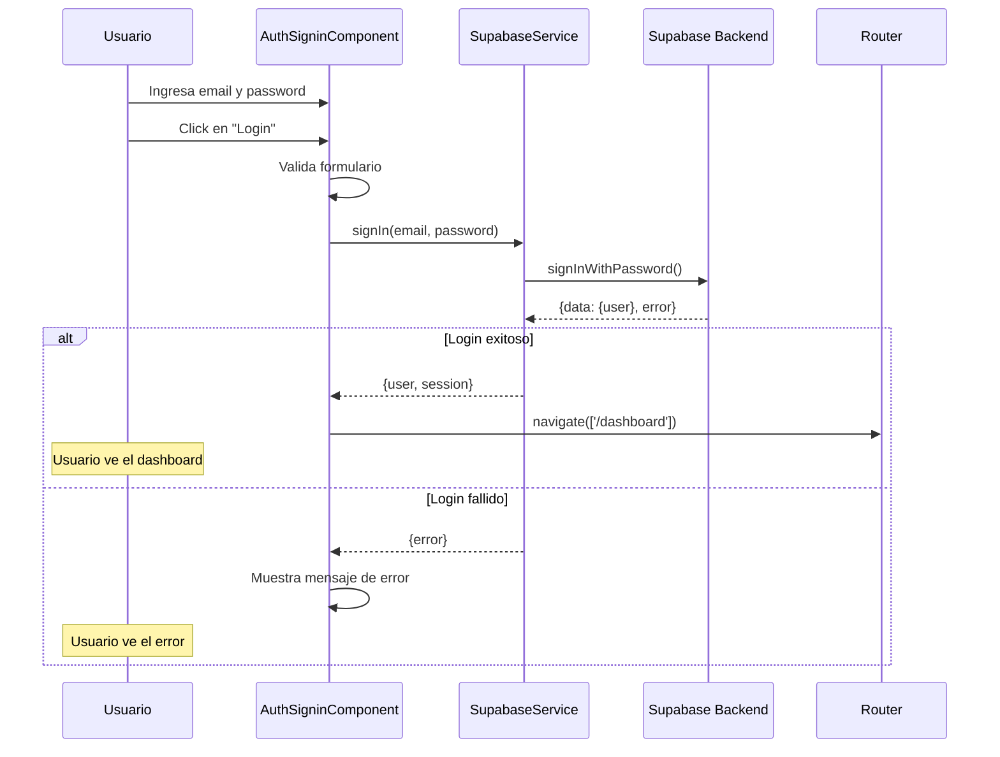
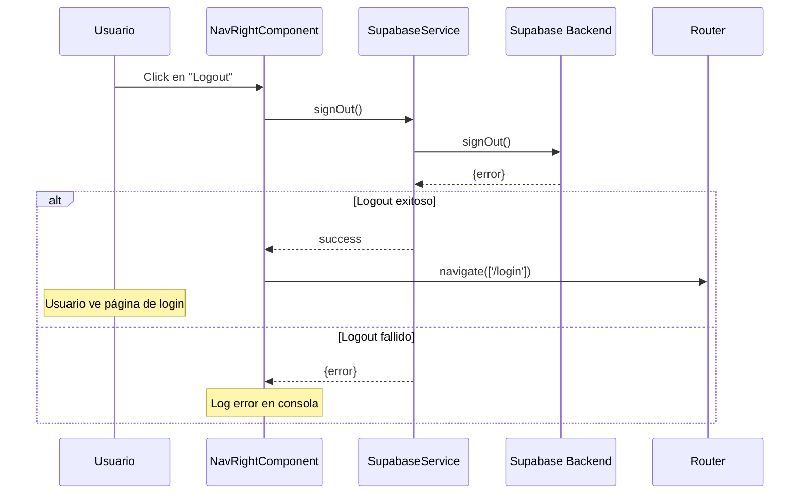

# 🔐 Sistema de Autenticación

Esta guía explica el funcionamiento del sistema de autenticación implementado con Supabase en el proyecto IGAS.

## Tabla de Contenidos

- [Arquitectura General](#arquitectura-general)
- [Componentes Principales](#componentes-principales)
- [Flujo de Autenticación](#flujo-de-autenticación)
- [Guards de Rutas](#guards-de-rutas)
- [Uso del Sistema](#uso-del-sistema)
- [Ejemplos de Código](#ejemplos-de-código)
- [Troubleshooting](#troubleshooting)

## Arquitectura General

El sistema de autenticación está construido sobre **Supabase** y utiliza el patrón de servicios de Angular junto con guards funcionales para proteger las rutas.

```
┌─────────────────────────────────────────────────────────────┐
│                    Usuario Final                             │
└────────────────────┬────────────────────────────────────────┘
                     │
                     ▼
┌─────────────────────────────────────────────────────────────┐
│           Componentes de Autenticación                       │
│  ┌──────────────────┐        ┌──────────────────┐          │
│  │ AuthSignin       │        │ NavRight         │          │
│  │ Component        │        │ Component        │          │
│  └────────┬─────────┘        └────────┬─────────┘          │
└───────────┼──────────────────────────┼─────────────────────┘
            │                          │
            ▼                          ▼
┌─────────────────────────────────────────────────────────────┐
│                  SupabaseService                             │
│  • signIn()                                                  │
│  • signOut()                                                 │
│  • signUp()                                                  │
│  • currentUser$ (Observable)                                 │
└────────────────────┬────────────────────────────────────────┘
                     │
                     ▼
┌─────────────────────────────────────────────────────────────┐
│                    Supabase Backend                          │
│  • Authentication                                            │
│  • Database                                                  │
└─────────────────────────────────────────────────────────────┘
```

## Componentes Principales

### 1. SupabaseService

**Ubicación**: `src/app/core/services/supabase.service.ts`

Servicio central que maneja toda la comunicación con Supabase.

**Responsabilidades**:
- Inicializar el cliente de Supabase
- Gestionar el estado de autenticación del usuario
- Proveer métodos para login, logout, y registro
- Exponer un Observable con el usuario actual

**Propiedades importantes**:
```typescript
private supabase: SupabaseClient;
private currentUser: BehaviorSubject<User | null>;
public currentUser$: Observable<User | null>;
```

**Métodos principales**:
- `signIn(email, password)`: Autenticación de usuario
- `signOut()`: Cierre de sesión
- `signUp(email, password)`: Registro de nuevo usuario
- `getSession()`: Obtener sesión actual
- `getUser()`: Obtener usuario actual

### 2. AuthSigninComponent

**Ubicación**: `src/app/demo/pages/authentication/auth-signin/`

Componente responsable de la interfaz de inicio de sesión.

**Características**:
- Formulario reactivo con validación usando Angular Signals Forms
- Manejo de estados: loading, error, submitted
- Validación de email y password
- Feedback visual de errores

**Signals importantes**:
```typescript
submitted = signal(false);      // Indica si el formulario fue enviado
error = signal('');              // Mensaje de error a mostrar
showPassword = signal(false);    // Toggle para mostrar/ocultar password
loading = signal(false);         // Estado de carga durante login
```

**Flujo del componente**:
```
Usuario ingresa credenciales
        ↓
Hace submit del formulario (onSubmit)
        ↓
Valida el formulario
        ↓
Llama a SupabaseService.signIn()
        ↓
¿Éxito? → Redirige a /dashboard
¿Error? → Muestra mensaje de error
```

### 3. NavRightComponent

**Ubicación**: `src/app/theme/layout/admin/nav-bar/nav-right/`

Componente de la barra de navegación que muestra información del usuario y opciones de logout.

**Características**:
- Muestra el email del usuario actual usando el Observable `currentUser$`
- Botón de logout que cierra la sesión
- Dropdown con opciones de usuario

**Métodos**:
```typescript
async logout() {
  const { error } = await this.supabase.signOut();
  if (!error) {
    this.router.navigate(['/login']);
  }
}
```

## Flujo de Autenticación

### Login Flow



### Logout Flow



### Flujo de Persistencia de Sesión

```
App Init
   ↓
SupabaseService constructor
   ↓
Recupera sesión de localStorage
   ↓
onAuthStateChange listener
   ↓
Actualiza currentUser$ BehaviorSubject
   ↓
Todos los componentes suscritos reciben actualización
```

## Guards de Rutas

### authGuard

**Ubicación**: `src/app/core/guards/auth.guard.ts`

Protege las rutas administrativas que requieren autenticación.

**Funcionamiento**:
```typescript
export const authGuard: CanActivateFn = async (route, state) => {
  const supabaseService = inject(SupabaseService);
  const router = inject(Router);

  const { data } = await supabaseService.getSession();

  if (data.session) {
    return true; // Permite acceso
  }

  // Redirige a login guardando la URL de retorno
  router.navigate(['/login'], {
    queryParams: { returnUrl: state.url }
  });
  return false;
};
```

**Uso en rutas**:
```typescript
{
  path: '',
  component: AdminComponent,
  canActivate: [authGuard], // ← Aplica el guard
  children: [
    { path: 'dashboard', loadComponent: ... },
    // ... más rutas protegidas
  ]
}
```

### publicGuard

**Ubicación**: `src/app/core/guards/auth.guard.ts`

Previene que usuarios autenticados accedan a páginas públicas (login, registro).

**Funcionamiento**:
```typescript
export const publicGuard: CanActivateFn = async (route, state) => {
  const supabaseService = inject(SupabaseService);
  const router = inject(Router);

  const { data } = await supabaseService.getSession();

  if (data.session) {
    // Usuario ya autenticado, redirige al dashboard
    router.navigate(['/dashboard']);
    return false;
  }

  return true; // Permite acceso a páginas públicas
};
```

**Uso en rutas**:
```typescript
{
  path: '',
  component: GuestComponent,
  canActivate: [publicGuard], // ← Aplica el guard
  children: [
    { path: 'login', loadComponent: ... },
    { path: 'register', loadComponent: ... }
  ]
}
```

## Uso del Sistema

### Cómo proteger una nueva ruta

1. Importa el guard en tu módulo de rutas:
```typescript
import { authGuard } from './core/guards/auth.guard';
```

2. Aplica el guard a la ruta:
```typescript
{
  path: 'mi-ruta-protegida',
  component: MiComponente,
  canActivate: [authGuard]
}
```

### Cómo acceder al usuario actual en un componente

```typescript
import { Component, inject } from '@angular/core';
import { SupabaseService } from 'src/app/core/services/supabase.service';

export class MiComponente {
  private supabase = inject(SupabaseService);

  // Opción 1: Usar el Observable directamente en el template
  currentUser$ = this.supabase.currentUser$;

  // Opción 2: Suscribirse en el código
  ngOnInit() {
    this.supabase.currentUser$.subscribe(user => {
      if (user) {
        console.log('Usuario actual:', user.email);
      }
    });
  }
}
```

En el template:
```html
@if (currentUser$ | async; as user) {
  <p>Bienvenido, {{ user.email }}</p>
}
```

### Cómo implementar "Remember Me"

Supabase gestiona automáticamente la persistencia de sesión usando localStorage. No necesitas implementar nada adicional para "Remember Me".

Si quieres permitir sesiones temporales (que se borren al cerrar el navegador):

```typescript
// En SupabaseService constructor
this.supabase = createClient(environment.supabase.url, environment.supabase.anonKey, {
  auth: {
    persistSession: true, // false para sesiones temporales
    storage: window.localStorage // o window.sessionStorage
  }
});
```

## Ejemplos de Código

### Ejemplo 1: Crear un botón de logout personalizado

```typescript
// mi-componente.component.ts
import { Component, inject } from '@angular/core';
import { Router } from '@angular/router';
import { SupabaseService } from 'src/app/core/services/supabase.service';

export class MiComponente {
  private supabase = inject(SupabaseService);
  private router = inject(Router);

  async handleLogout() {
    const { error } = await this.supabase.signOut();

    if (error) {
      console.error('Error al cerrar sesión:', error);
      alert('Error al cerrar sesión');
    } else {
      console.log('Sesión cerrada exitosamente');
      this.router.navigate(['/login']);
    }
  }
}
```

```html
<!-- mi-componente.component.html -->
<button (click)="handleLogout()">Cerrar Sesión</button>
```

### Ejemplo 2: Mostrar contenido solo para usuarios autenticados

```typescript
// dashboard.component.ts
import { Component, inject, signal } from '@angular/core';
import { SupabaseService } from 'src/app/core/services/supabase.service';

export class DashboardComponent {
  private supabase = inject(SupabaseService);
  userEmail = signal<string>('');

  ngOnInit() {
    this.supabase.currentUser$.subscribe(user => {
      if (user) {
        this.userEmail.set(user.email || '');
      }
    });
  }
}
```

```html
<!-- dashboard.component.html -->
<div class="user-info">
  <h2>Bienvenido, {{ userEmail() }}</h2>
</div>
```

### Ejemplo 3: Redirigir después del login a la página original

El `authGuard` ya guarda automáticamente la URL de retorno en los query params. Para usarla:

```typescript
// auth-signin.component.ts
import { ActivatedRoute } from '@angular/router';

export class AuthSigninComponent {
  private route = inject(ActivatedRoute);
  private router = inject(Router);

  async onSubmit(event: Event) {
    // ... validación y login ...

    if (data.user) {
      // Obtener returnUrl de los query params
      const returnUrl = this.route.snapshot.queryParams['returnUrl'] || '/dashboard';
      this.router.navigate([returnUrl]);
    }
  }
}
```

### Ejemplo 4: Agregar validación de roles

```typescript
// role.guard.ts
import { inject } from '@angular/core';
import { Router, CanActivateFn } from '@angular/router';
import { SupabaseService } from '../services/supabase.service';

export const roleGuard = (requiredRole: string): CanActivateFn => {
  return async (route, state) => {
    const supabaseService = inject(SupabaseService);
    const router = inject(Router);

    const { data } = await supabaseService.getSession();

    if (!data.session) {
      router.navigate(['/login']);
      return false;
    }

    // Obtener el rol del usuario desde los metadatos
    const userRole = data.session.user.user_metadata['role'];

    if (userRole === requiredRole) {
      return true;
    }

    // Usuario no tiene el rol requerido
    router.navigate(['/unauthorized']);
    return false;
  };
};

// Uso en rutas
{
  path: 'admin',
  component: AdminPanelComponent,
  canActivate: [authGuard, roleGuard('admin')]
}
```

## Troubleshooting

### Problema: "Session is null" después del login

**Causa**: El cliente de Supabase no está inicializado correctamente o las credenciales son incorrectas.

**Solución**:
1. Verifica que `environment.supabase.url` y `environment.supabase.anonKey` estén configurados correctamente
2. Verifica en la consola de Supabase que el usuario existe
3. Revisa la consola del navegador para errores específicos

### Problema: El usuario se redirige infinitamente entre login y dashboard

**Causa**: Conflicto entre `authGuard` y `publicGuard`.

**Solución**:
Verifica que las rutas están configuradas correctamente:
- Rutas administrativas: usan `authGuard`
- Rutas públicas (login, register): usan `publicGuard`

### Problema: "Cannot inject SupabaseService"

**Causa**: El servicio no está provisto en el nivel correcto.

**Solución**:
Asegúrate de que `SupabaseService` tiene el decorator `@Injectable({ providedIn: 'root' })`:
```typescript
@Injectable({
  providedIn: 'root'
})
export class SupabaseService { ... }
```

### Problema: Los guards no funcionan

**Causa**: Los guards funcionales requieren Angular 15+.

**Solución**:
Verifica la versión de Angular en `package.json`. Este proyecto usa Angular 21, por lo que los guards funcionales son compatibles.

### Problema: CORS errors al conectar con Supabase

**Causa**: El dominio de la aplicación no está autorizado en Supabase.

**Solución**:
1. Ve a tu proyecto en Supabase
2. Settings → Authentication → Site URL
3. Agrega `http://localhost:4200` para desarrollo
4. Para producción, agrega tu dominio real

### Problema: El Observable currentUser$ no se actualiza

**Causa**: No hay suscripción al `onAuthStateChange` de Supabase.

**Solución**:
Verifica que en `SupabaseService` constructor tengas:
```typescript
this.supabase.auth.onAuthStateChange((event, session) => {
  this.currentUser.next(session?.user ?? null);
});
```

## Referencias

- [Documentación de Supabase Auth](https://supabase.com/docs/guides/auth)
- [Angular Guards Documentation](https://angular.io/guide/router#preventing-unauthorized-access)
- [Angular Signals](https://angular.io/guide/signals)
- [RxJS Observables](https://rxjs.dev/guide/observable)

## Próximos Pasos

Posibles mejoras para el sistema de autenticación:

1. Implementar recuperación de contraseña
2. Agregar autenticación con redes sociales (Google, GitHub, etc.)
3. Implementar sistema de roles y permisos
4. Agregar autenticación de dos factores (2FA)
5. Implementar refresh token automático
6. Agregar logout en todas las pestañas simultáneamente

---

**Última actualización**: 2026-01-11
